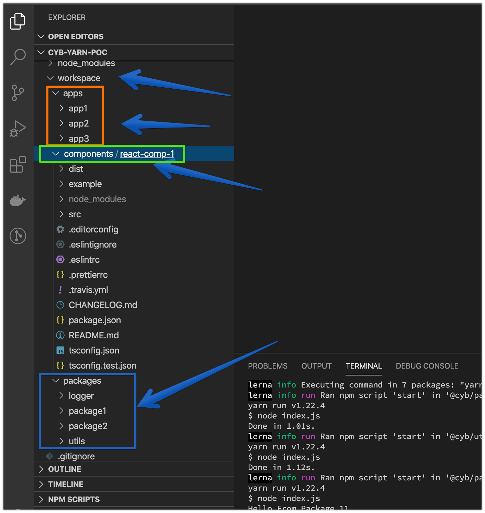
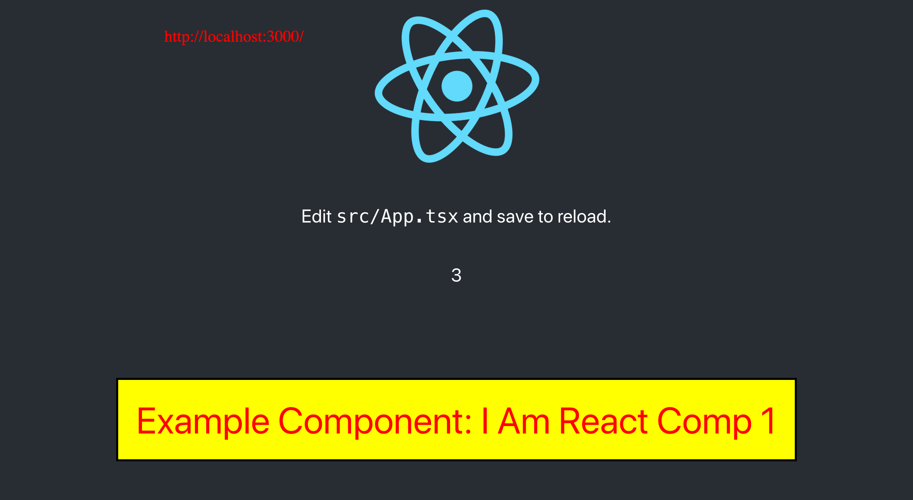
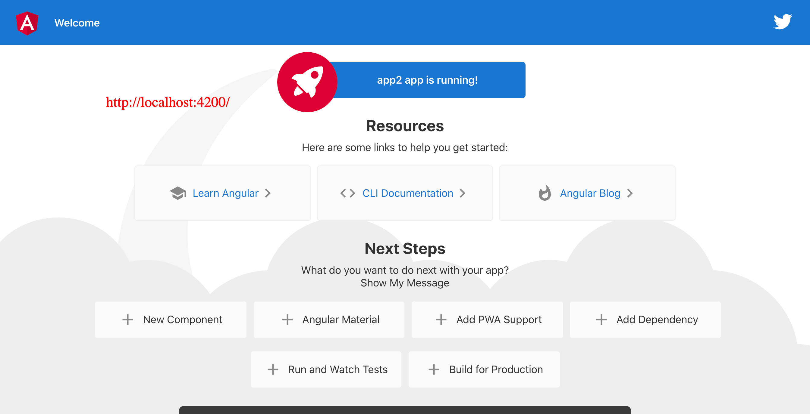
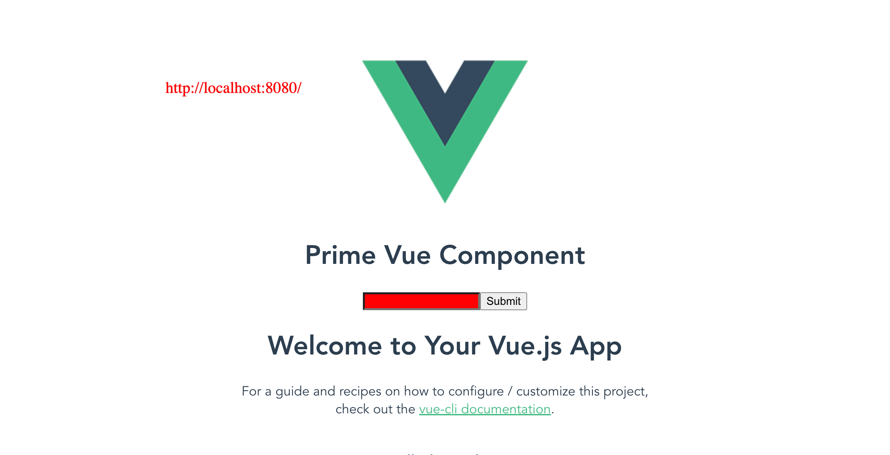
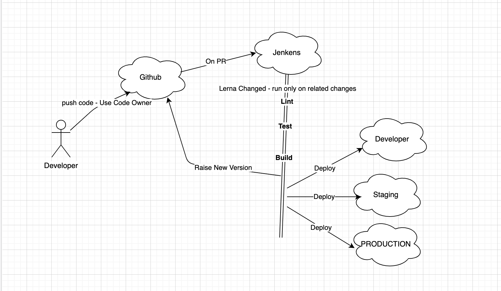

# cyb-yarn-poc

This is a POC for Yarn workspace and Lerna

### how to start?

1. run `yarn install`
2. run scripts that you want in `package.json`

for example:
run `yarn start` to run all apps

### What we have in this project?

1. apps:

- app1 - react (use react-comp-1)
- app2 - angular (use logger package)
- app3 - vue (include Prime Vue Framework)

2. components

   - react lib - react-comp-1

3. packages

- package1
- package2
- logger
- utils

### scripts

There is a lot of commands on package.json

- see in scripts

### showcase

### CI

- still need to investigate

